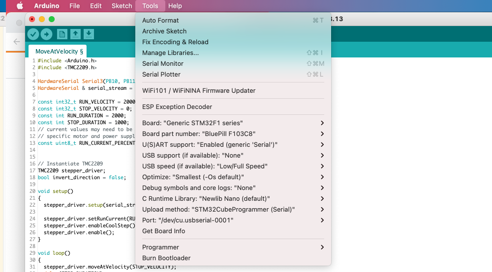

# Getting started with Ethersweep (Still in development)
### How to get started...
### This only works on the current development version 4.5.0 of Ethersweep hardware. It is intended to find and debug hardware issues.
The code is compiled and uploaded using the Arduino IDE with stm32duino installed. Check [this](https://github.com/stm32duino/) to install. (Add this link 
```https://github.com/stm32duino/BoardManagerFiles/raw/main/package_stmicroelectronics_index.json``` 
to the Arduino IDE board manager)

Set these settings under 'Tools' in the Arduino IDE:



# Get the motor spinning
To test if the motor is connected properly you can run this [code](https://github.com/Neumi/ethersweep/blob/master/getting_started/code_for_testing_v450/motor_test/motor_test.ino).

The motor should spin in different directions with different speeds.

